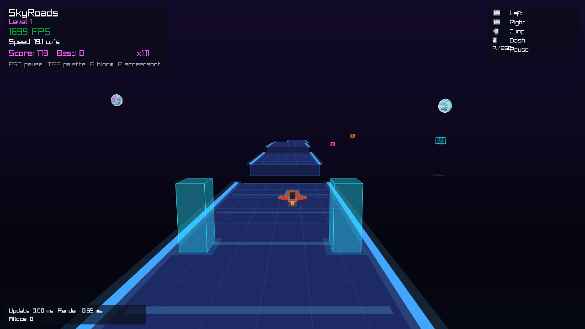

# SkyRoads — Endless Runner

A retro-inspired SkyRoads-style endless runner built with **C++20** and **raylib**.
Fly a speeder ship across a neon platform, dash for style points, and climb the leaderboard.

## Screenshots





## Features

- **Endless forward-scrolling runner** on a single neon-lit platform
- **Jump** with coyote time and input buffering for forgiving controls
- **Dash** boost (ground only) with cooldown — earns style score and increases your multiplier
- **Dynamic difficulty** — forward speed and hazard probability ramp over time, capped at a configurable ceiling
- **Scoring** — distance score + style score combined with a speed-based multiplier (×1.00 – ×2.50)
- **Persistent leaderboard** — top 10 scores saved to a binary file with seeded defaults
- **3 swappable color palettes** — Neon Dusk, Cyan Sunrise, Magenta Storm (cycle at runtime)
- **Optional bloom overlay** toggle
- **3D ship model** — Kenney Space Kit speeder (OBJ), with wireframe neon outline and engine exhaust trail
- **Rich visual scene dressing** — starfield with twinkling, mountain silhouettes, floating decorative cubes with glow halos, ambient particles, Tron-style grid, scrolling track bands, and speed streaks
- **Landing particle bursts** on touchdown
- **Dynamic follow camera** — smoothly tracks the ship, rolls on strafe, and widens FOV during speed boosts
- **Fixed timestep simulation** (1/120 s) decoupled from rendering with interpolation
- **Deterministic simulation** — Xorshift32 RNG, seeded runs are perfectly reproducible
- **14 automated simulation tests** via CTest (jump, dash, air control, scoring, difficulty, restart invariants, etc.)
- **Debug heap-allocation tracker** — overrides `operator new` in debug builds; warns when the update loop allocates
- **Performance overlay** — update/render milliseconds and allocation count shown on-screen
- **Cross-platform** — macOS, Linux, Windows; CMake `FetchContent` auto-downloads raylib 5.5

## Controls

### Gameplay

| Key | Action |
|-----|--------|
| **A** / **←** | Strafe left |
| **D** / **→** | Strafe right |
| **Space** | Jump (buffered; coyote time applies) |
| **Shift** | Dash forward (ground only, 0.5 s cooldown) |
| **R** | Restart same seed |
| **N** | New run (random seed) |
| **Tab** | Cycle color palette |
| **B** | Toggle bloom overlay |
| **Esc** / **P** | Pause |

### Menus

| Key | Action |
|-----|--------|
| **↑** / **W** | Move selection up |
| **↓** / **S** | Move selection down |
| **Enter** / **Space** | Confirm selection |
| **Esc** | Back / Exit |

### Game Over

| Key | Action |
|-----|--------|
| **R** | Retry same seed |
| **N** | New run |
| **Esc** / **Enter** | Return to main menu |

## Architecture

```text
.
├── CMakeLists.txt          # Build config — fetches raylib, defines skyroads + sim_tests targets
├── core/                   # Foundation / infrastructure
│   ├── Config.hpp          #   Compile-time constants (physics, visuals, scoring, difficulty)
│   ├── Rng.hpp / .cpp      #   Deterministic Xorshift32 PRNG
│   ├── Assets.hpp / .cpp   #   Zero-alloc asset path resolver ("assets/<relative>")
│   └── PerfTracker.hpp/.cpp#   Debug-only heap allocation counter (operator new override)
├── game/                   # Game state & high-level logic
│   ├── Game.hpp            #   Central Game struct, screen enum, player/input/leaderboard types
│   └── Game.cpp            #   Init, input reading, meta actions, scoring, leaderboard I/O
├── sim/                    # Pure simulation (no rendering dependencies)
│   ├── Sim.hpp             #   SimStep() interface
│   └── Sim.cpp             #   Physics, jump/dash mechanics, scoring, difficulty ramp, particles
├── render/                 # All visual output
│   ├── Palette.hpp / .cpp  #   LevelPalette struct + 3 built-in palettes
│   └── Render.hpp / .cpp   #   Scene drawing, camera, HUD, exhaust particles, screen overlays
├── src/
│   └── main.cpp            #   Entry point — window init, fixed-timestep loop, perf measurement
├── tests/
│   └── SimTests.cpp        #   14 deterministic simulation tests (CTest)
├── assets/
│   └── models/             #   Kenney craft_speederA OBJ model
└── scripts/                #   Build / run / test helpers for macOS/Linux and Windows
```

### Key Design Decisions

| Aspect | Approach |
|--------|----------|
| **Sim / Render split** | `sim/` has zero rendering includes; can be tested headlessly via `sim_tests` |
| **Fixed timestep** | Simulation ticks at 120 Hz; rendering interpolates between previous and current state |
| **Zero-alloc update** | Preallocated particle pools + stack data; debug build warns on any heap allocation during update |
| **Deterministic replay** | Same seed → identical run; RNG state is explicit, never global |
| **Configuration** | All tuning constants live in `core/Config.hpp` as `constexpr` values |

## Requirements

- CMake 3.21+
- A C++20-capable compiler:
  - macOS: Apple Clang (Xcode Command Line Tools)
  - Linux: GCC 11+ or Clang 14+
  - Windows: Visual Studio 2022 (MSVC) or Ninja + Clang/GCC

## Quick Start (macOS/Linux)

```bash
./scripts/build.sh
./scripts/run.sh
```

First build downloads raylib via CMake `FetchContent`, so it can take a bit.

Run simulation tests:

```bash
./scripts/test.sh
```

## Quick Start (Windows PowerShell)

```powershell
./scripts/build.ps1
./scripts/run.ps1
```

First build downloads raylib via CMake `FetchContent`, so it can take a bit.

Run simulation tests:

```powershell
./scripts/test.ps1
```

## Manual Build

### macOS/Linux

```bash
cmake -S . -B build -DCMAKE_BUILD_TYPE=Release
cmake --build build --config Release
```

Run:

```bash
./build/skyroads
```

### Windows (Visual Studio generator)

```powershell
cmake -S . -B build
cmake --build build --config Release
```

Run:

```powershell
./build/Release/skyroads.exe
```

## Credits

- Ship model from [Kenney Space Kit](https://kenney.nl/assets/space-kit) (CC0)
- Built with [raylib](https://www.raylib.com/) 5.5
